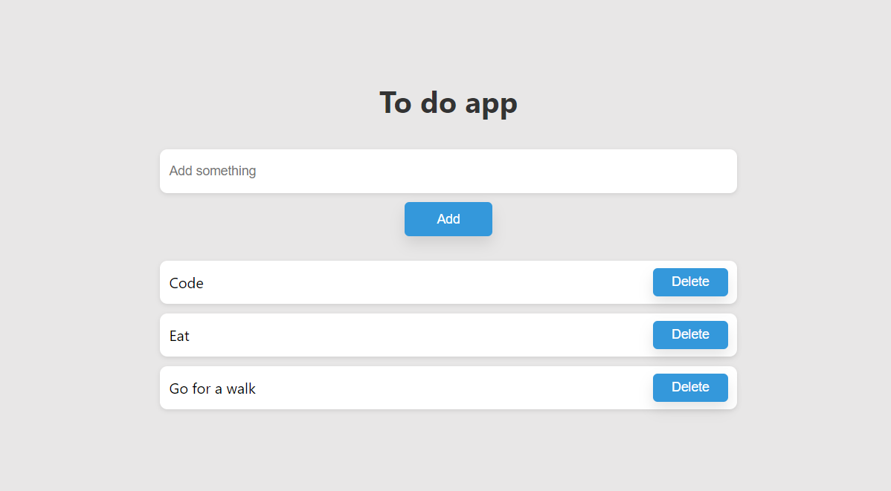

# To-Do-App

Manage your tasks efficiently with the ToDo App. A simple and intuitive application to help you stay organized and focused.

## Features

- Add tasks with titles and optional descriptions.
- Delete tasks you no longer need.
- Easy-to-use and responsive design.

## Getting Started

1. Open this repository in your web browser.
2. Add a new task by typing in the task title and clicking "Add Task."
3. Delete tasks by clicking the delete button.
4. Stay productive and organized!

## Languages Used

- HTML
- CSS
- JavaScript

## Screenshots

## Contributing

Contributions are welcome! Please open an issue or submit a pull request.

## Feedback

Have feedback or suggestions? Feel free to [open an issue] at Email : hmadafzal00@gmail.com
